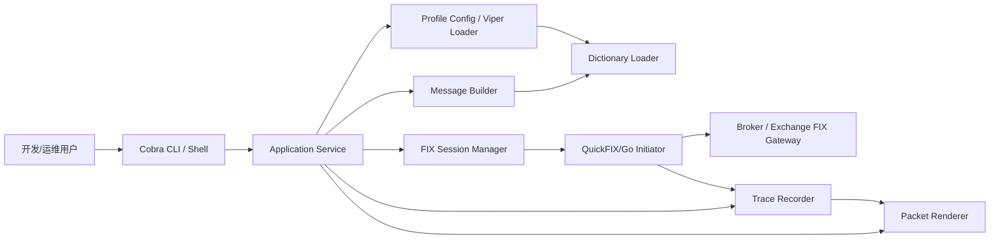

# fix-tool 整体架构方案

## 1. 项目概述

`fix-tool` 是一个使用 Go 开发的 FIX 协议 CLI 测试工具，面向开发和运维人员，用于联调 FIX 网关、排查交易链路问题、验证常用交易报文收发。工具以单二进制方式交付，支持一次性子命令和交互式 shell 两种模式，能够打印请求包、响应包、解析字段、序列号、耗时和校验结果。

第一期不追求标准 FIX 全量 MsgType 覆盖，而是优先实现开发运维最高频的交易链路：登录、登出、心跳、TestRequest、新单、撤单、改单、成交回报和拒绝类消息。后续通过配置化字典、自定义 tag 和 raw message 能力扩展更多 MsgType。

## 2. 业务需求

### 2.1 P0 必须交付

- Profile 配置管理：支持 host、port、FIX 版本、SenderCompID、TargetCompID、账号、密码、TLS、心跳间隔、序列号策略、字典文件路径。
- 自定义 tag 配置：支持字段编号、字段名、类型、枚举值、是否敏感、展示名称。
- FIX 会话管理：支持 Logon、Logout、Heartbeat、TestRequest、重连、MsgSeqNum、ResendRequest、SequenceReset。
- 常用交易消息：支持 NewOrderSingle、OrderCancelRequest、OrderCancelReplaceRequest。
- 响应处理：接收并展示 ExecutionReport、Reject、BusinessMessageReject、Session Reject。
- 报文详情打印：同时展示 raw FIX、tag/value、字段名、字段含义、方向、耗时、BodyLength/CheckSum 校验结果。
- 两种运行方式：支持 `fix-tool order new ...` 一次性命令，也支持 `fix-tool shell` 交互式连续操作。
- 敏感信息脱敏：账号、密码、Token、RawData、签名和用户标记为敏感的 tag 默认脱敏。

### 2.2 P1 后续增强

- 场景脚本：按 YAML/TOML 文件顺序执行登录、下单、撤单、断言响应。
- 响应断言：支持按 MsgType、ClOrdID、OrderID、ExecType、OrdStatus、RejectReason 等字段断言。
- 导出能力：支持 JSON、CSV、NDJSON 导出 trace。
- 离线解析：支持 `inspect raw` 解析历史 raw FIX 报文。
- mock acceptor：本地模拟 FIX 服务端，辅助离线开发和集成测试。

### 2.3 P2 扩展方向

- 批量压测模式：统计 RTT、成功率、拒单率、消息吞吐。
- 更多 MsgType 模板：Quote、MarketData、OrderStatusRequest、Allocation 等。
- 交易所或券商模板包：针对常见自定义字段提供可选 profile 样例。

## 3. 系统架构

本项目采用单体 CLI 架构，不提供 HTTP 服务，不引入数据库。核心链路如下：



### 3.1 分层结构

- CLI 层：负责命令、参数绑定、交互式 shell 输入解析，不承载业务逻辑。
- Service 层：负责编排 profile、session、message builder、response matcher、renderer。
- Adapter 层：封装 QuickFIX/Go、终端输出、文件导出等外部能力。
- Domain 层：定义 Profile、MessageTemplate、CustomFieldDef、LogonTag、Scenario、Trace 等核心模型。

## 4. 技术栈决策

| 技术 | 决策 | 理由 |
|---|---|---|
| Go | 使用 | 单二进制交付、适合网络 CLI 工具、跨平台成本低 |
| QuickFIX/Go | 使用 | 成熟 FIX 引擎，支持会话、序列号、字典、心跳、重发机制 |
| Cobra | 使用 | 适合多级 CLI 子命令、help、completion 和参数管理 |
| Viper | 使用 | 符合 Go 规则中的配置管理要求，支持文件、环境变量和 flag 合并 |
| Zerolog | 使用 | 结构化日志，便于开发运维排查 |
| Uber Fx | 使用 | 统一组装配置、日志、服务和生命周期，避免全局变量 |
| Validator | 可选使用 | 对 profile、scenario、命令参数做强校验 |
| Gin/GORM | 不使用 | 本项目不提供 HTTP API，也不需要数据库，避免无关依赖 |

## 5. 模块划分

```text
cmd/fix-tool/
  main.go
config/
  default.toml
internal/
  app/
  cli/
  config/
  dictionary/
  fixsession/
  message/
  render/
  scenario/
  trace/
  validate/
pkg/
  fixfield/
testdata/
  dictionaries/
  messages/
  scenarios/
docs/project/fix-tool/
```

### 5.1 模块职责

- `cmd/fix-tool`：应用入口，只负责启动 Fx 应用。
- `internal/app`：应用组装、生命周期、公共依赖注册。
- `internal/cli`：Cobra root command、子命令、交互式 shell。
- `internal/config`：加载默认配置、用户配置、私有配置、环境变量和 flags，输出强类型配置。
- `internal/dictionary`：加载 FIX 字典、自定义 tag 元信息、字段名和枚举映射。
- `internal/fixsession`：封装 QuickFIX/Go initiator、session 生命周期、收发消息回调。
- `internal/message`：构造 P0 MsgType 请求，支持 raw overlay 和自定义 tag。
- `internal/render`：输出 raw、table、json、csv，负责脱敏和字段解释。
- `internal/scenario`：执行场景脚本、响应等待、断言。
- `internal/trace`：记录请求响应、方向、时间、序列号、关联 ID 和耗时。
- `internal/validate`：集中校验 profile、scenario、命令参数。
- `pkg/fixfield`：可复用字段常量、MsgType 常量和工具函数。

## 6. 数据模型

### 6.1 Profile

```text
Profile
- name
- begin_string
- sender_comp_id
- target_comp_id
- username
- password
- host
- port
- tls
- heartbeat_interval
- reset_on_logon
- data_dictionary
- transport_data_dictionary
- app_data_dictionary
- custom_field_defs
- logon_tags
- output
```

### 6.2 CustomFieldDef

```text
CustomFieldDef
- tag
- name
- type
- required
- sensitive
- enums
- description
```

### 6.3 LogonTag

```text
LogonTag
- tag
- value
```

### 6.4 MessageTrace

```text
MessageTrace
- trace_id
- profile
- direction
- msg_type
- msg_seq_num
- cl_ord_id
- order_id
- exec_type
- ord_status
- raw
- fields
- sent_at
- received_at
- latency
- checksum_valid
- body_length_valid
```

### 6.4 Scenario

```text
Scenario
- name
- profile
- steps

Step
- name
- action
- input
- wait
- assert
```

## 7. CLI 接口设计概览

### 7.1 配置类

```bash
fix-tool config init
fix-tool config validate --profile uat
fix-tool profile list
fix-tool profile show uat
```

### 7.2 会话类

```bash
fix-tool logon --profile uat
fix-tool logout --profile uat
fix-tool heartbeat --profile uat
fix-tool test-request --profile uat --id ping-001
```

### 7.3 交易类

```bash
fix-tool order new --profile uat --symbol AAPL --side buy --qty 100 --price 10.25
fix-tool order cancel --profile uat --orig-cl-ord-id C001 --symbol AAPL --side buy
fix-tool order replace --profile uat --orig-cl-ord-id C001 --qty 200 --price 10.30
```

### 7.4 raw 与解析类

```bash
fix-tool raw send --profile uat --msg-type D --tag 55=AAPL --tag 54=1
fix-tool inspect raw '8=FIX.4.4|9=...|35=D|...|10=000|'
```

### 7.5 场景与交互类

```bash
fix-tool shell --profile uat
fix-tool run scenario.yaml
```

## 8. 非功能性设计

### 8.1 安全

- TLS 默认开启证书校验。
- 允许通过配置显式修改 TLS 校验行为，但必须在配置校验和启动日志中输出英文风险提示。
- 敏感字段默认脱敏，包括账号、密码、Token、签名、RawData，以及自定义 tag 中标记 `sensitive = true` 的字段。
- 示例配置不得包含真实密钥、密码、Token。
- 日志不打印完整认证信息和完整敏感 raw 报文。

### 8.2 可靠性

- 使用 QuickFIX/Go 管理 session、序列号、心跳、重发、登出。
- 每个 profile 独立管理连接和 store 路径。
- 一次性命令在发送完成并收到目标响应或超时后退出。
- shell 模式保持长连接，支持用户主动 logout 和退出。
- goroutine 必须绑定 context，退出时释放 ticker、连接和文件句柄。

### 8.3 可观测性

- 每条收发包生成 `trace_id`。
- 输出方向、时间、MsgType、MsgSeqNum、ClOrdID、OrderID、ExecType、OrdStatus、latency。
- 支持 table、raw、json 输出。
- 错误日志使用结构化字段，日志消息使用英文。

### 8.4 可测试性

- 消息构造、字段解析、脱敏、渲染、断言逻辑做单元测试。
- FIX session adapter 使用接口隔离，测试中可替换为 fake session。
- 集成测试通过 mock acceptor 或 test profile 执行。

## 9. 部署方案

### 9.1 本地使用

- 交付形式：单二进制 `fix-tool`。
- 支持环境：macOS、Linux；Windows 后续验证。
- 配置路径：优先当前目录，其次用户目录，如 `~/.config/fix-tool/config.toml`。

### 9.2 CI/CD

- `go test ./...`
- `go vet ./...`
- `govulncheck ./...`
- 交叉编译 macOS/Linux。
- 生成 release 压缩包和 checksum。

## 10. 任务分解

| 序号 | 任务 | 依赖 |
|---|---|---|
| 01 | 项目骨架、配置模型、日志、Fx 组装 | 无 |
| 02 | QuickFIX/Go session adapter 与 profile 加载 | 01 |
| 03 | 报文捕获、解析、字段名映射、脱敏渲染 | 01、02 |
| 04 | admin 命令：logon/logout/heartbeat/test-request | 02、03 |
| 05 | order 命令：new/cancel/replace 与 ExecutionReport 匹配 | 02、03 |
| 06 | 交互式 shell | 04、05 |
| 07 | raw send、inspect raw、自定义 tag overlay | 03、05 |
| 08 | scenario runner 与断言 | 04、05、07 |
| 09 | 测试、mock acceptor、样例配置 | 01-08 |
| 10 | 打包发布与使用文档 | 01-09 |

## 11. 风险登记

| 风险 | 影响 | 应对 |
|---|---|---|
| 自定义 FIX 字典质量不稳定 | 报文校验和字段解释错误 | 提供 `config validate` 和字典加载错误详情 |
| 不同网关 session 策略差异大 | 登录、序列号、重发行为不一致 | 将 ResetOnLogon、store、heartbeat、reconnect 等做 profile 级配置 |
| raw 报文包含敏感信息 | 运维排查时泄露账号或认证数据 | 默认脱敏，完整 raw 输出需要显式开关 |
| 一次性命令与 shell 生命周期不同 | goroutine 泄漏或退出时丢响应 | 统一 SessionManager，所有后台任务绑定 context |
| 全量 MsgType 需求膨胀 | 第一版延期 | MVP 明确只覆盖常用交易链路，其他通过 raw 和模板扩展 |

## 12. 领域术语表

| 术语 | 含义 |
|---|---|
| Profile | 一套 FIX 连接配置 |
| Dictionary | FIX XML 数据字典 |
| CustomFieldDef | 用户自定义字段定义 |
| LogonTag | Logon 报文中发送的自定义字段 |
| MsgType | FIX 消息类型，如 `A`、`0`、`D`、`F`、`G`、`8` |
| Trace | 一条请求或响应的记录 |
| Scenario | 多步骤联调脚本 |
| Initiator | 主动连接 FIX 网关的一端 |
| Acceptor | 接收 FIX 连接的一端 |

## 13. 架构决策记录

### ADR-001：采用 QuickFIX/Go 作为 FIX 引擎

- 背景：FIX session 涉及序列号、心跳、重发、校验、字典和连接生命周期，自研风险高。
- 决定：底层使用 QuickFIX/Go。
- 后果：开发重点放在 CLI、配置、报文构造、展示和场景编排；同时需要适配 QuickFIX/Go 的配置模型。

### ADR-002：采用 Cobra + Viper 构建 CLI 与配置系统

- 背景：工具需要大量子命令、profile 配置、环境变量覆盖和 flags 覆盖。
- 决定：Cobra 负责命令组织，Viper 负责配置加载。
- 后果：命令层保持薄封装，业务逻辑下沉到 service；配置必须统一反序列化为强类型结构。

### ADR-003：MVP 只覆盖常用交易链路

- 背景：标准 FIX MsgType 范围很大，全量实现会显著拉长周期。
- 决定：第一期覆盖登录、登出、心跳、TestRequest、新单、撤单、改单、回报和拒绝类消息。
- 后果：其他消息通过 `raw send`、自定义 tag 和后续模板逐步扩展。

### ADR-004：TLS 默认校验，但允许配置修改

- 背景：开发和联调环境可能存在自签证书，但工具会处理交易认证信息。
- 决定：默认开启 TLS 证书校验，允许 profile 中显式配置修改。
- 后果：配置校验必须提示风险；生产 profile 不建议关闭证书校验。
